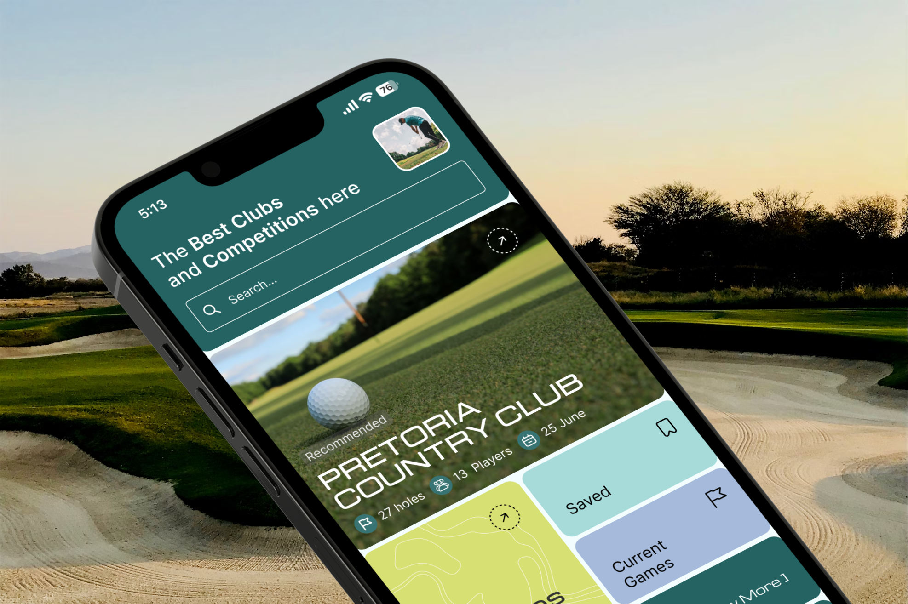

<br />


<!-- HEADER SECTION -->
<h6 align="center">Luca Breebaart Interactive Development 302</h6>
<p align="center">
</br>

<p align="center">

  <a href="https://github.com/LucaBreebaart/lycra" >
    
  </a>
  
  <h3 align="center">L Y R C R A</h3>

  <p align="center">
    Short Project Slogan / Description <br>
      <a href="https://github.com/LucaBreebaart/lycra"><strong>Explore the docs »</strong></a>
   <br />
   <br />
   <a href="https://youtu.be/QHTPWY50kZY?si=dR1KsTwP2Iy7QAvS">View Demo</a>
    ·
    <a href="https://github.com/LucaBreebaart/lycra/issues">Report Bug</a>
    ·
    <a href="https://github.com/LucaBreebaart/lycra/issues">Request Feature</a>
</p>
<!-- TABLE OF CONTENTS -->

## Table of Contents

- [About the Project](#about-the-project)
  - [Project Description](#project-description)
  - [Built With](#built-with)
- [Getting Started](#getting-started)
  - [Prerequisites](#prerequisites)
  - [How to install](#how-to-install)
- [Features and Functionality](#features-and-functionality)
- [Concept Process](#concept-process)
  - [Ideation](#ideation)
  - [Wireframes](#wireframes)
- [Development Process](#development-process)
  - [Implementation Process](#implementation-process)
    - [Highlights](#highlights)
  - [Future Implementation](#peer-reviews)
- [Final Outcome](#final-outcome)
  - [Mockups](#mockups)
  - [Video Demonstration](#video-demonstration)
- [Roadmap](#roadmap)
- [Contributing](#contributing)
- [License](#license)
- [Contact](#contact)

<!--PROJECT DESCRIPTION-->

## About the Project

<!-- header image of project -->



### Project Description

This project manages golf tournaments and enables competition participation via a mobile app. Users can enter tournaments, view golf course details, and use a digital scorecard. The app features a leaderboard to track progress and badges for competition achievements. Developed with Visual Studio and Expo using React Native, it ensures consistent performance on iOS and Android. The goal is to provide a practical platform for golf enthusiasts and organisers, promoting engagement and community involvement in golfing activities.

### Built With
* [Visual Studio](https://visualstudio.microsoft.com/)
* [Expo](https://expo.dev/)
* [React Native](https://reactnative.dev/)
* [GitHub](https://github.com/)


## Getting Started

These instructions will get you a copy of the project up and running on your local machine for development and testing purposes.

### Prerequisites

For development, the latest version of Visual Studio is required. The latest version can be downloaded from [Visual Studio](https://visualstudio.microsoft.com/)

### Installation

1. Clone the repo using GitHub Desktop
    - Download and install [GitHub Desktop](https://desktop.github.com/)
    - Open GitHub Desktop and click on `File` > `Clone repository`
    - Enter the repository URL: `https://github.com/LucaBreebaart/lycra`
    - Choose the local path where you want to clone the repository and click `Clone`

2. Open the project in Visual Studio
    - Open Visual Studio
    - Click on `File` > `Open`

3. Crate .env with your firebase config

    ```sh 
   FIREBASE_API_KEY=
   FIREBASE_AUTH_DOMAIN=
   FIREBASE_PROJECT_ID=
   FIREBASE_STORAGE_BUCKET=
   FIREBASE_MESSAGING_SENDER_ID=
   FIREBASE_APP_ID=
    ```

4. Install packages

    ```sh
    npm install
    ```

5. Run project

    ```sh
    npm start
    ```

6. Download Expo Go

    Download Expo Go on Android or iOS:
    - [iOS](https://apps.apple.com/us/app/expo-go/id982107779)
    - [Android](https://play.google.com/store/apps/details?id=host.exp.exponent&hl=en_ZA&gl=US)


## Features and Functionality

### Feature 1: Joining a Competition

- **Joining**: Upon viewing and selecting a competition, users are directed to the competition details page.
Here, they can join the competition if they haven't already.

<br>

![image2][image2]

### Feature 2: Entering Scores

- **Entering Scores**: Once joined, users can navigate through the golf course virtually within the app.
They can enter their score for each hole played.
After entering scores for all holes, users proceed to the complettion page where they can confirm and enter their scores.
- **Viewing Scores**:
After entering scores, users are directed to the live leaderboard section.
Here, they can see the progress of all participants in real-time.
The leaderboard updates dynamically as scores are entered by other players.

<br>

![image3][image3]

### Feature 3: Create and Manage Competitions

- **Create New Competition**: Easily create new competitions by providing necessary details such as name, date, and other relevant information.
- **Add Holes to Competitions**: Add individual holes to each competition, specifying details like hole number, par, images and distance.

<br>

![image4][image4]

## Concept Process

The `Conceptual Process` is the set of actions, activities and research that was done when starting this project.

### Ideation and Moodboard

![image5][image5]

### Wireframes

![image6][image6]

<!-- DEVELOPMENT PROCESS -->
## Development Process

The `Development Process` is the technical implementations and functionality done in the frontend and backend of the application.

### Implementation Process
<!-- stipulate all of the functionality you included in the project -->

* Developed `authentication` for user login and registration.
* Created `scorecard` feature to track and input golf scores.
* Implemented `competition creation` and `participation` functionality.
* Designed `leaderboard` to display rankings in real-time.
* Utilised `React Navigation` for seamless page transitions.
* Employed `FlatList` for efficient rendering of score data.
* Developed `profile management` allowing users to update their details.
* Used `Expo` for running on both iOS and Android.

#### Highlights
<!-- stipulated the highlight you experienced with the project -->
* Relationships through the database, and calculating final scores.
* Using Firebase for authentication and data storage.

#### Bugs
<!-- stipulated the challenges you faced with the project and why you think you faced it or how you think you'll solve it (if not solved) -->
* Sign up page sometimes crashes
* Play competition page sometimes doesnt refresh

### Future Implementation
<!-- stipulate functionality and improvements that can be implemented in the future. -->

* Update the user profile page to show their current entered competitions
* View user profiles and entered competitions
* Serach funtionality
* Can only play competitions on the selected date
* Add more user info, such as a calculated handicap

<!-- MOCKUPS -->
## Final Outcome

### Mockups

![image10][image10]

<!-- VIDEO DEMONSTRATION -->
### Video Demonstration

To see a run through of the application, click below:

[View Demonstration](https://www.youtube.com/watch?v=QHTPWY50kZY)

<!-- ROADMAP -->
## Roadmap

See the [open issues](https://github.com/username/projectname/issues) for a list of proposed features (and known issues).

<!-- CONTRIBUTING -->
## Contributing

Contributions are what makes the open-source community such an amazing place to learn, inspire, and create. Any contributions you make are **greatly appreciated**.

1. Fork the Project
2. Create your Feature Branch (`git checkout -b feature/AmazingFeature`)
3. Commit your Changes (`git commit -m 'Add some AmazingFeature'`)
4. Push to the Branch (`git push origin feature/AmazingFeature`)
5. Open a Pull Request

<!-- AUTHORS -->
## Authors

* **Luca Breebaart** - [Luca Breebaart](https://github.com/LucaBreebaart)

<!-- LICENSE -->
## License

Distributed under the MIT License. See `LICENSE` for more information.

<!-- LICENSE -->
## Contact

* **Luca Breebaart** - [luca.breebaart99@gmail.com](mailto:luca.breebaart99@gmail.com) - [@lucabreebaart](https://www.instagram.com/lucabreebaart/) 
* **Project Link** - https://github.com/LucaBreebaart/Lycra 

<!-- ACKNOWLEDGEMENTS -->


<!-- MARKDOWN LINKS & IMAGES -->
[image1]: /path/to/image.png
[image2]: /readmeAssets/Join.jpg
[image3]: /readmeAssets/scores.jpg
[image4]: /readmeAssets/discover.jpg
[image5]: /readmeAssets/moodboard.jpg
[image6]: /readmeAssets/wireframes.jpg
[image7]: /path/to/image.png
[image8]: /path/to/image.png
[image9]: /path/to/image.png
[image10]: /readmeAssets/mockup.jpg


<!-- Refer to https://shields.io/ for more information and options about the shield links at the top of the ReadMe file -->
[linkedin-shield]: https://img.shields.io/badge/-LinkedIn-black.svg?style=flat-square&logo=linkedin&colorB=555
[linkedin-url]: https://www.linkedin.com/in/nameonlinkedin/
[instagram-shield]: https://img.shields.io/badge/-Instagram-black.svg?style=flat-square&logo=instagram&colorB=555
[instagram-url]: https://www.instagram.com/instagram_handle/
[behance-shield]: https://img.shields.io/badge/-Behance-black.svg?style=flat-square&logo=behance&colorB=555
[behance-url]: https://www.behance.net/name-on-behance/
